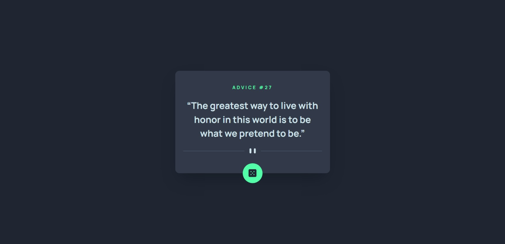

# Frontend Mentor - Advice generator app solution

This is a solution to the [Advice generator app challenge on Frontend Mentor](https://www.frontendmentor.io/challenges/advice-generator-app-QdUG-13db). Frontend Mentor challenges help you improve your coding skills by building realistic projects.

## Table of contents

- [Overview](#overview)
  - [The challenge](#the-challenge)
  - [Screenshot](#screenshot)
  - [Links](#links)
- [My process](#my-process)
  - [Built with](#built-with)
- [Author](#author)

## Overview

### The challenge

Users should be able to:

- View the optimal layout for the app depending on their device's screen size
- See hover states for all interactive elements on the page
- Generate a new piece of advice by clicking the dice icon

### Screenshot

### Links

- Solution URL: [Click Here](https://github.com/yacineragueb/Frontend-challenge-3/tree/master/advice-generator-app-main)
- Live Site URL: [Click Here](https://advice-generator-challenge-3.vercel.app/)

## My process

### Built with

- Semantic HTML5 markup
- CSS custom properties
- Flexbox
- CSS Grid
- Mobile-first workflow
- Smooth user experience
- [React](https://reactjs.org/) - JS library
- [Tailwind](https://tailwindcss.com/) - css framework
- [Axios](https://axios-http.com/) - HTTP client

## Author

- Website - [Yacine Ragueb](https://yacineragueb.vercel.app/)
- Frontend Mentor - [@yacineragueb](https://www.frontendmentor.io/profile/yacineragueb)
- LinkedIn - [@yacineragueb](https://www.linkedin.com/in/yacineragueb/)
