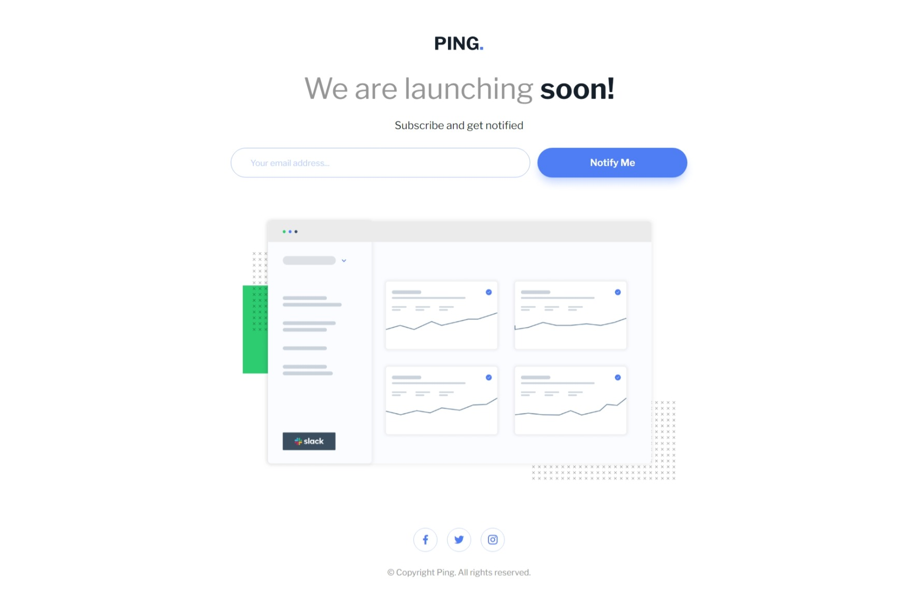

# Frontend Mentor - Ping coming soon page solution

This is a solution to the [Ping coming soon page challenge on Frontend Mentor](https://www.frontendmentor.io/challenges/ping-single-column-coming-soon-page-5cadd051fec04111f7b848da). Frontend Mentor challenges help you improve your coding skills by building realistic projects. 

## Table of contents

- [Overview](#overview)
  - [The challenge](#the-challenge)
  - [Screenshot](#screenshot)
  - [Links](#links)
- [My process](#my-process)
  - [Built with](#built-with)
  - [What I learned](#what-i-learned)
  - [Continued development](#continued-development)
- [Author](#author)

## Overview

### The challenge

Users should be able to:

- View the optimal layout for the site depending on their device's screen size
- See hover states for all interactive elements on the page
- Submit their email address using an `input` field
- Receive an error message when the `form` is submitted if:
	- The `input` field is empty. The message for this error should say *"Whoops! It looks like you forgot to add your email"*
	- The email address is not formatted correctly (i.e. a correct email address should have this structure: `name@host.tld`). The message for this error should say *"Please provide a valid email address"*

### Screenshot

### Links

- Solution URL: [Click Here](https://github.com/Yaciine19/Frontend-challenge-3/tree/master/ping-coming-soon-page-master)
- Live Site URL: [Click Here](https://ping-coming-page-challenge-3.vercel.app/)

## My process

### Built with

- Semantic HTML5 markup
- CSS custom properties
- Flexbox
- CSS Grid
- Mobile-first workflow
- [Taiwlind](https://tailwindcss.com/) - framework css

### What I learned

28/02/2025

Time has really flown by since the start of the new year, and with success from Allah, here I am completing the last challenge from the "newbie" level on Frontend Mentor. I wish I could have solved them all, but unfortunately, I don’t have the money for that 😂.

Even though these challenges are simple, they have taught me a lot of things I didn’t know and have improved my understanding and experience in building websites and designs using HTML, CSS, and JS. Not to mention one of the most popular CSS frameworks, Tailwind—it has been one of the best things I’ve learned at the beginning of this new year.

I won’t deny that I was a bit confused when I first started learning and applying it, but with continuous practice and thanks to these challenges, I can now build even the most complex designs with ease and make them fully responsive on all devices.

What I want to say is: don’t give up, my friend! Never abandon your goal, no matter how small your progress may seem. Don’t let yourself get discouraged—just keep going, and you’ll see results that will truly amaze you. You never fail until you stop trying.

I’d also like to thank everyone who joined me on this journey, especially the Frontend Mentor community! 👌

### Continued development

Even though I have completed these challenges, this is just the beginning. I will continue learning, exploring, and mastering new techniques. Now, I am moving on to the Junior-level challenges. 🚀

## Author

- Website - [Yacine Ragueb](https://yacineragueb.vercel.app/)
- Frontend Mentor - [@Yaciine19](https://www.frontendmentor.io/profile/Yaciine19)
- LinkedIn - [@yacineRagueb](https://www.linkedin.com/in/yacine-ragueb-8033a9302/)
